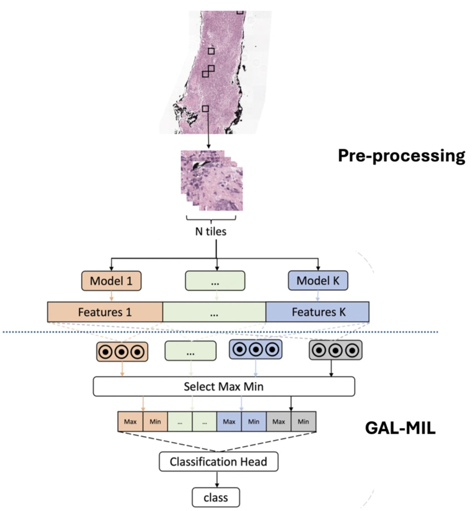

# GAS-MIL: Group-Aggregative Selection Multi-Instance Learning for Ensemble of Foundation Models in Digital Pathology Image Analysis

Author: Peiran Quan (peiran.quan@utsouthwestern.edu)

## Intorduction
In this project, we introduce the Group-Aggregative Selection Multi-Instance Learning (GAS-MIL) framework, a flexible and scalable approach for integrating multiple foundation models while preserving their individual strengths in feature extraction. By employing multi-instance learning, GAS-MIL enhances the capacity to capture nuanced, context-dependent features in complex pathology images while ensuring computational efficiency. Our comprehensive evaluation on four public cancer datasets - including prostate cancer (PANDA), ovarian cancer (UBC-OCEAN), lung cancer (TCGA and NLST), and breast cancer (TCGA-BRCA) - demonstrates the robust performance of GAS-MIL across diverse pathological conditions. The main contributions of this work include: (1) development of a novel framework that effectively combines features from multiple foundation models to enhance prediction accuracy and stability, and (2) demonstration of superior performance compared to existing methods across multiple cancer datasets and diagnostic tasks.

### GAL-MIL Model

We aim to enhance model stability and robustness by integrating features generated from multiple foundation models without significantly increasing computational demands. We enhance Chowder's capabilities by increasing its network width and maintaining the Max-Min layer to optimize efficiency. The figure below shows our GAS-MIL algorithm workflow. 

## Pre-processing

We need to pre-process pathology image (WSI: whole slide image) for the data input file of GAL-MIL model. 

We can use any tool below to get fundation models and feature extraction.

<pre>
Phikon (https://github.com/owkin/HistoSSLscaling)
UNI (https://github.com/mahmoodlab/UNI)
Prov-GigaPath(https://github.com/prov-gigapath/prov-gigapath )
CONCH(https://github.com/mahmoodlab/CONCH )
PLIP(https://github.com/PathologyFoundation/plip )
LVM-Med (https://github.com/duyhominhnguyen/LVM-Med )
</pre>

Please use the repository [quanpr64/feature_extraction](https://github.com/quanpr64/feature_extraction) to pre-process the pathology image.

## Required Dependencies

- Python 3.11.5
- numpy==2.2.4
- pandas==2.2.3
- PyYAML==6.0.2
- torch==2.1.1

Create the Conda Environment named as 'gasmil'
<pre>
conda create --name gasmil python=3.11 
</pre>

Install env/requirement.txt to 'gasmil'
<pre>
conda activate gasmil
pip install -r env/requirements.txt
</pre>

    
## User Guideline

### run Gas-Mil

"example_data/example.csv": using one slide from TCGA-BRCA as example, random select 200 patches from this slide, and create this file "example.csv" using UNI and Phikon extract features.

Run the analysi of Gas-Mil
<pre>
python main.py --csv_path data/example.csv --feature_key_list "uni_feature,phikon_feature" --model_path model/gasmil_uni_phikon.pt
</pre> 

Parameters:

| Parameter | Description | Default Value |
| --------- | ----------- | ------------ |
| csv_path | inference data csv file path | |
| feature_key_list | features from which foundation models | |
| model_path | the path to save the model "gasmiluniphikon.pt" | |
| config | contains gasmil params | config.yml |
| batch_size | Number of batch size | |
| num_workers | Number of workers for data loader | |
| device | CPU or GPU | cuda:0 |
| save_csv_path | save results to | os.path.join(os.getcwd(), '/output/result.csv') |

config.yml: the gasmil parameters

| Parameter | Description | Default Value |
| --------- | ----------- | ------------ |
| attn |  | false |
| bottom_k |  | 20 |
| clf_feat_dim |  | 96 |
| groupall_bottom_k |  | 20 |
| groupall_top_k |  | 20 |
| grouped_feat_dim |  | 256 |
| groups |  | - 1024; - 768 |
| in_channels |  | 1792 |
| include_groupall |  | true |
| num_class |  | 2 |
| top_k |  | 20 |

### Input File
The input file is the extract features from pathology images using the tools such as Phikon or UNI. An example file is "example_data/example.csv".

| | image_id | uni_feature | phikon_feature |label|
| --- | --- | ----| --- | ----|
| 0 |	TCGA-A2-A0D0-01Z-00-DX1.4FF6B8E5-703B-400F-920A-104F56E0F874 |	data/uni_feature_TCGA-A2-A0D0-01Z-00-DX1.4FF6B8E5-703B-400F-920A-104F56E0F874.npy |	data/phikon_feature_TCGA-A2-A0D0-01Z-00-DX1.4FF6B8E5-703B-400F-920A-104F56E0F874.npy |	0 |

### Output File

An output file example can be output/result.csv. The information in this csv file is

* image_id: image_id from the input file
* prediction: 0 or 1. O: ; 1:
* label: 0 or 1. 0: ; 1:

### Trouble Shooting

### License
UT Southwestern Medical Center License 2025
    
